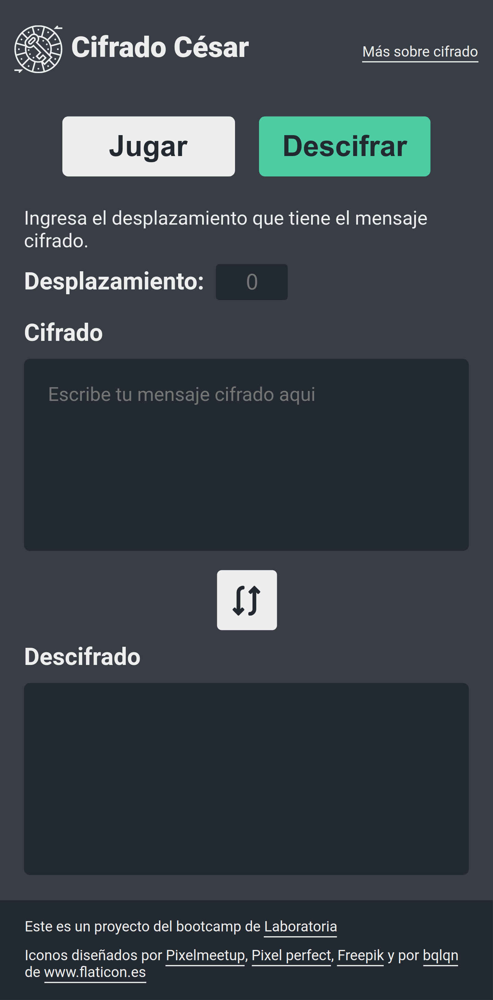

# Juego de Cifrado Cesar

## Descripción del Proyecto

Este proyecto es una página web que permite al usuario aprender mediante el juego lo que es el cifrado César y practicarlo. El usuario también puede encriptar y desencriptar mensajes utilizando el cifrado César. En la pantalla se puede seleccionar ambos modos mediante dos botones, un botón para activar el juego y otro botón que permite cifrar o descifrar mensajes. Debajo de estos contenedores existe un área para seleccionar o mostrar el desplazamiento en el cifrado, un contenedor para escribir el mensaje y otro contenedor en el que se muestra las palabras del juego o el resultado después de cifrar/descifrar el mensaje.

Para jugar, el usuario debe seleccionar el botón de "JUEGO". En el juego los usuarios debe cifrar o descifrar una palabra y el desplazamiento que aparecen en la pantalla. Cuando la palabra ingresada es correcta, se verá un :heavy_check_mark: encima del contenedor del mensaje y aparecerá una nueva palabra en 3 segundos. Luego de acertar en cinco palabras, aparece un mensaje de felicitaciones por lograr terminar el juego.

En cualquier momento se puede intercambiar los contenedores de mensaje cifrado y descifrado con el botón que se encuentra al medio de estos. En el modo de juego este botón reinicia el juego y cambia el modo de juego, para que el usuario cifre o descifre las palabras.

Para ver la página web haz [click aqui](https://rodruxdev.github.io/cesar-cipher-game/)

## Proceso de Diseño

El diseño fue inspirado en Google Translate, con dos contenedores para escritura y traducción y un botón que permite intercambiar los lenguajes de los contenedores.

Se utilizo dos botones independientes para cambiar entre el modo de juego y el modo de cifrado/descifrado, para utilizar colores diferentes para identificar cual es el modo activado. Junto a los botones se tiene una breve descripción y un contenedor para ingresar el despĺazamiento.

Se decidió utilizar el tipo de letra Roboto, para que la lectura sea clara. Además se decidió utilizar colores oscuros para el fondo y colores claros para las letras o los resaltados para reducir la fatiga en los ojos del usuario.

### Previsualizacion de Pantalla Mobile

### Previsualizacion de Pantalla de Escritorio

## Tecnologías Utilizadas

Para el proyecto se utilizó las siguientes tecnologías:

* HTML 5
* CSS 3
* JavaScript

## Funcionamiento y Limitaciones del Proyecto

El desplazamiento ingresado puede ser cualquier número entero positivo o negativo. Sin embargo, el cifrado entre de las letras no admite la "ñ" y tampoco las vocales con tilde o diéresis.
El cifrado entre números y símbolos se realiza de forma separada desde el símbolo de espacio hasta el símbolo de arroba en el código ASCII. El resto de los símbolos no tienen un cambio o desplazamiento en el cifrado o descifrado.

El botón de "JUEGO" activa el juego para el usuario. El botón de "CIFRAR" o "DESCIFRAR" activa el modo de cifrado/descifrado y permite hacer un intercambio entre los contenedores de mensaje. El bótón que se encuentra entre los contenedores permite el mismo intercambio dentre cifrado y descifrado en ambos modos de uso.

## Instalación del Proyecto en Local

1. Clona o descarga el repositorio en tu equipo.
2. Ingresa al directiorio del repositorio por terminal.
3. Instala las dependencias del proyecto utilizando NodeJS con el comando `npm install`.
4. Inicia un servidor local del proyecto con el comando `npm start`.
5. Ingresa en tu navegador a la dirección `http://localhost:5000`.

Este proyecto es parte de la ruta del bootcamp de [Laboratoria - Frontend Developer](https://www.laboratoria.la/) del año 2020. Estoy realizando sus proyectos de forma autodidacta e independiente.

  <h3>
    <a href="https://rodrigojgq.github.io/cesar-cipher-game/">
      Página Web
    </a>
     | 
    <a href="https://github.com/Laboratoria/BOG002-cipher">
      Instrucciones
    </a>
  </h3>

